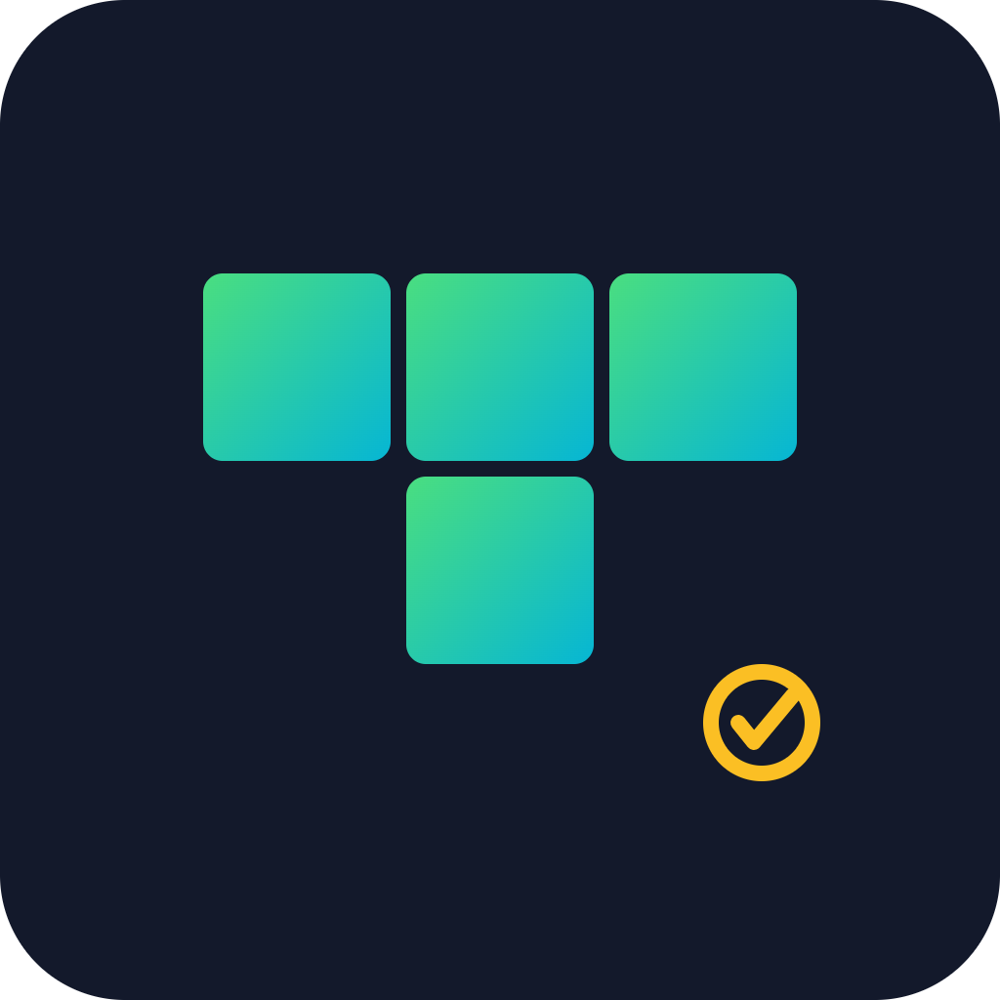

# BlockFall


Tetris where every high score mints a dynamic, on-chain proof-of-skill NFT.

## Overview

BlockFall is a classic Tetris game where reaching score milestones or clearing special line combos mints a dynamic NFT that evolves in art based on your achievement tier. Players build a visual, verifiable history of their Tetris skill as a growing NFT collection on Solana. Compressed NFTs keep minting cheap enough for every single game session.

## Problem

Traditional Tetris scores vanish after the session with no lasting proof of skill or way to showcase achievements. A great run is forgotten the moment the browser tab closes.

## Solution

BlockFall mints milestone achievements as dynamic NFTs that visually evolve and are verifiable on-chain, creating a permanent skill record. Casual gamers and NFT collectors can now build and show off a growing collection tied to real in-game performance.

## Features (MVP)

- Playable Tetris game with standard controls and scoring
- Auto-mint compressed NFT when score/combo milestones are hit
- NFT art dynamically changes design based on achievement tier
- On-chain leaderboard showing top NFT holders and their scores
- Wallet connect (Phantom) for minting and viewing collection

## Tech stack

- Next.js (frontend)
- Phaser.js or custom canvas engine (game logic/rendering)
- Solana Web3.js
- Metaplex Bubblegum (compressed NFTs)
- Anchor (on-chain program)
- Phantom Wallet Adapter

## How it works

```
Player (browser)
    |
    v
Next.js + Canvas/Phaser Tetris game
    |
    v
Phantom Wallet Adapter (connect/sign)
    |
    v
Solana Web3.js --> Anchor program (verify milestone/score)
    |
    v
Metaplex Bubblegum (mint compressed NFT)
    |
    v
On-chain leaderboard (scores + NFT holders)
```

Players connect their Phantom wallet and play Tetris in the browser. When a score or combo milestone is reached, the client calls an Anchor program on Solana that verifies the achievement and triggers a Metaplex Bubblegum mint of a compressed NFT. The NFT's metadata reflects the achievement tier, and an on-chain leaderboard tracks top holders and scores.

## Roadmap

- Add seasonal leaderboards with ranked NFT badges
- Introduce social sharing and NFT trading marketplace integration
- Expand to multiplayer battle mode with wagered NFT stakes

## Pitch

- [Pitch deck (PDF)](docs/pitch.pdf)
- [Pitch script](docs/pitch-script.md)

## Team

- Name — Role — [GitHub](#) / [Twitter](#)
- Name — Role — [GitHub](#) / [Twitter](#)
- Name — Role — [GitHub](#) / [Twitter](#)

Built for the Colosseum hackathon (Solana and other chains).

---

🎬 Pitch video: [docs/pitch-video.mp4](docs/pitch-video.mp4)
